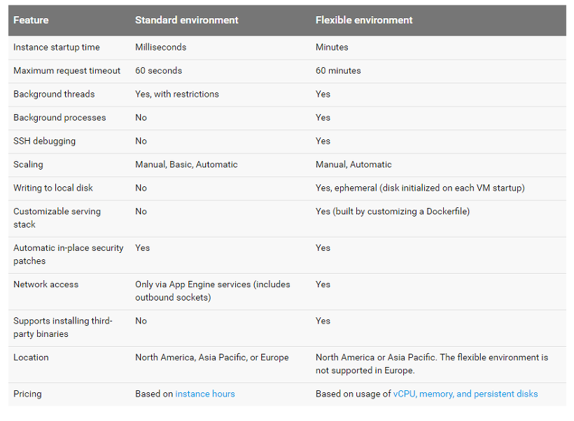

# 💻 App Engine

Permite administrar tu aplicacion sin tener que crear un servidor (server less)

Si necesitas menos tiempo en configuracion y sientes que el tiempo de salida es importante, es decir que con solo subir a google tu codigo el se encargara de que este disponible&#x20;

<figure><figcaption></figcaption></figure>

Tambien te da servios APIs integrados con bases de datos NoSql, balanceo de carga, Api de autenticacion&#x20;

Con el SDK podras administrar en local tus pruebas y en la consola de google ya el paso a produccion&#x20;

## entorno Estandar o Flexible

### Estandar

Este se configura de lenguajes y versiones de la aplicacion, tambien con librerias y APIs compatibles del entorno estandar de App Engine

**Requisitos**

* debes usar versiones espesificas de Python, PHP, Java, node, Go, etc ...
* Dependen de un entorno de zonas de pruebas esto permite que la aplicacion se propague entre varios servidores asi la app se ejecuta dentro de su entorno seguro independiente de la ubicacion, hardware o sistema operativo

**Workflow**

1. Proceso de desarrollo de la aplicacion y pruebas en entorno local
2. Junto con el SDK se ejecuta en App Engine
3. App Engine escala y entrega la aplicacion&#x20;

### Flexible

Si el entorno de pruebas del estandar se torna restrictivo, este modo permite correr tu aplicacion en contenedores de [**Docker**](../../learning/docker.md) en las maquinas virtuales de [**Compute Engine**](compute-engine.md)&#x20;

App Engine se encargara de administras las apps por ti&#x20;

Esto permite que App Engine controle las versiones y actualizaciones semanalmente de tus instancias de VMs

Tambien puedes personalizar todo el entorno de trabajo con los **DockerFiles**&#x20;

<figure><figcaption></figcaption></figure>

